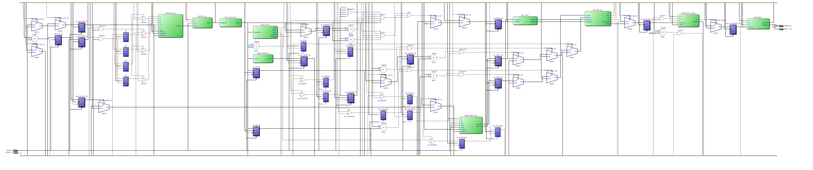
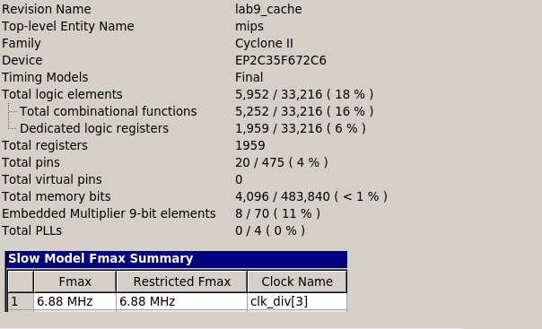

=============================================
Лабораторна робота №9
=============================================

Тема
----------

Додавання кеш-пам'яті до конвеєрного RISC ядра.

Хід роботи
----------

**Завдання.**
Завданням було прикрутити до конвеєрного ядра з 8 лаби кеш даних як посередник між пам'яттю даних та процесором.
Тип кешу не задавався, тому я вирішив зробити асоціативний кеш.

**Створення проекту.** Проект було вирішено реалізувати на HDL SystemVerilog, як більш функціональному наступнику Verilog. 
Він складається з багатьох модулів, що описані в декількох файлах. У якості модуля використовувався також ALU, GPIO та решта модулiв MIPS з минулої лабораторної. 

**Що зроблено.**
Усі вимоги, зазначені у специфікації, було виконано. Пам'ять даних було вирішено зробити з 128-бітною шиною даних
для виконання транзакцій в кеш за один такт. Кеш 4-слівний, 2 лінії на модуль, 4-асоціативний, слово 32 біти. 
політика витіснення LRU, працює за 1 такт при попаданні
та 2 такти при промаху. 
На своєму асемблері переписав програму сортування з 6 лаби та перевірив в Incisive, що все працює як треба.

Так виглядає RTL схема mips, написаного на SystemVerilog.

Так виглядають ресурси використані у цьому ядрі.

Так цю роботу взяв у Матюші а всі інші у Шліхти мдаа ну продовжимо. Ой на канікулах хочу поїхати в Польщу подорожувати думаю буде круто
ой напишите мені про дешеві подороді коли будете це читати тільки не забудьте. Ой треба сюди якийсь віршик так для шика для душі
Все года и века и эпохи подряд
Всё стремится к теплу от морозов и вьюг.
Почему ж эти птицы на север летят,
Если птицам положено только на юг?

Слава им не нужна и величие.
Вот под крыльями кончится лёд,
И найдут они счастие птичее,
Как награду за дерзкий полёт.

Что же нам не жилось, что же нам не спалось?
Что нас выгнало в путь по высокой волне?
Нам сиянья пока наблюдать не пришлось.
Это редко бывает - сиянья в цене!

Тишина. Только чайки - как молнии.
Пустотой мы их кормим из рук.
Но наградою нам за безмолвие
Обязательно будет звук.

Как давно снятся нам только белые сны,
Все иные оттенки снега замели.
Мы ослепли давно от такой белизны,
Но прозреем от черной полоски земли.

Наше горло отпустит молчание,
Наша слабость растает, как тень.
И наградой за ночи отчаянья
Будет вечный полярный день.

Север, воля, надежда, - страна без границ,
Снег без грязи, как долгая жизнь без вранья.
Воронье нам не выклюет глаз из глазниц,
Потому что не водится здесь воронья.

Кто не верил в дурные пророчества,
В снег не лёг ни на миг отдохнуть,
Тем наградою за одиночество
Должен встретиться кто-нибудь.

Скажу на парі хто написав

Висновки
-----------

Під час виконання лабораторної роботи я прикрутив до конвеєрного RISC ядра кеш-контролер, що зберігав у собі 
часто використовувані дані з основної пам'яті. Такий контролер можна використовувати для будь-яких типів пам'яті, які можна підключити як зовнішні модулі.
кеш асоціативний та багатолінійний, що дає оптимум по швидкодії та проценту попадань.

